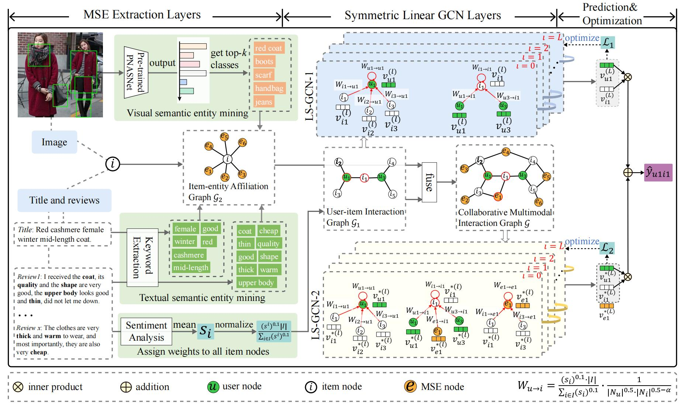

# MEGCF
## Multimooddal Semantic Entity Based Graph Convolution Collaborative Filtering

In most E-commerce platforms, whether the displayed items trigger the user's interest depends largely on their most eye-catching multimodal content (e.g., images, videos, titles, reviews, etc.). increasing efforts focus on modeling multimodal user preference, and the pressing paradigm is to incorporate complete multimodal deep features of the items into the recommendation module. 
However, we argue that existing work ignores the mismatch problem between multimodal feature extraction (MFE) and user interest modeling (UIM), that is, MFE and UIM have different emphases. 
Specifically, MFE is migrated from and adapted to upstream tasks such as image classification and is essentially a content-oriented and non-personalized process, whereas UIM, with its greater focus on understanding user interaction, is essentially a user-oriented and personalized process.
Therefore, the direct incorporation of MFE into UIM for purely user-oriented tasks tends to introduce a large number of preference-independent multimodal features and contaminate the embedding representations in UIM.

In this work, to address the mismatch between MFE and UIM, we focus on how to translate content-oriented MFE into user-oriented. Considering that user interactions are often closely related to semantic-rich entities in the multimodal content of items, we propose to extract such entities in MFE and model the semantic correlation between them and user interactions. To implement this and to obtain a more informative embeddings, we construct a symmetric Graph Convolution Network (GCN) module to model the semantic correlation and extend it to a higher order.
Additionally, because the textual item reviews hold important user-oriented sentiment information, we utilize advanced sentiment analysis technique to mine the sentiment features and design a sentiment weighting strategy to enhance graph convolution operations, which further facilitate the translation of MFE into user-oriented one. Overall, we propose a novel model, Multimodal semantic Entity based Graph convolution Collaborative Filtering, short for MEGCF, to achieve matching and complementarity between the MFE and the UIM.
Extensive experiments and in-depth analysis demonstrate the state-of-the-art performance of MEGCF and the superiority of each component in MEGCF for modeling multimodal user preferences.

We provide tensorflow implementation for MEGCF.

## We reproduced the results from the paper and saved them in Model/Log/result-Art(or beauty, Taobao).txt.

## prerequisites

- Tensorflow 1.10.0
- Python 3.5
- NVIDIA GPU + CUDA + CuDNN
